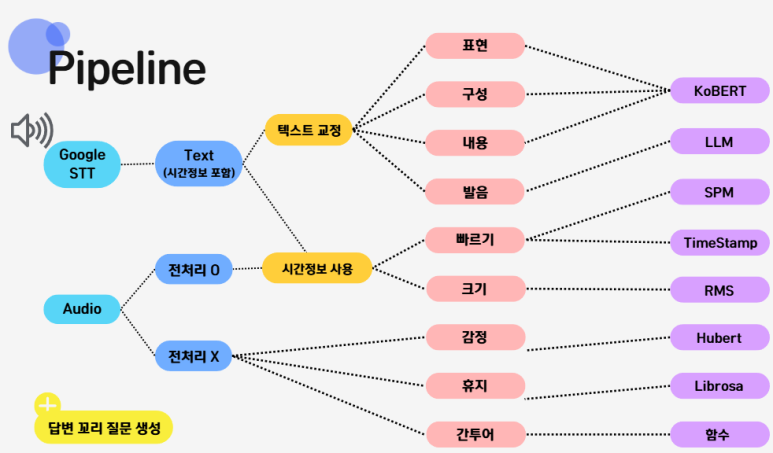
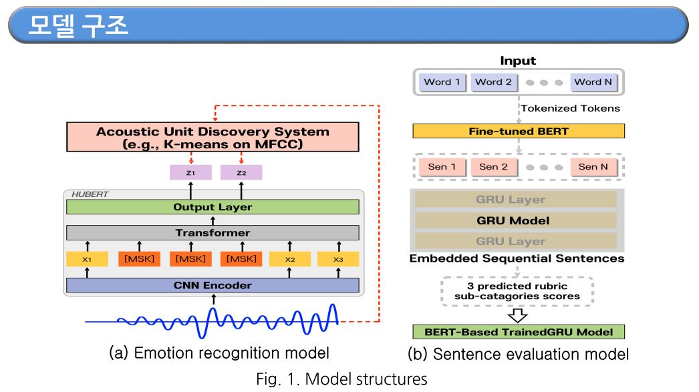
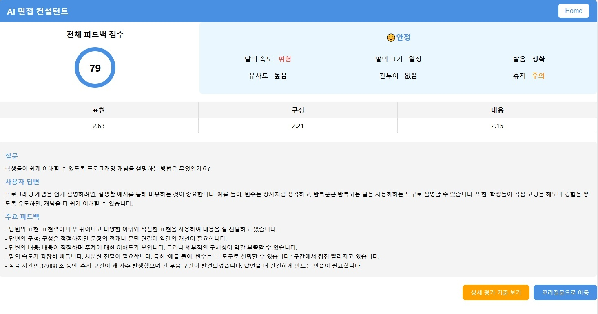
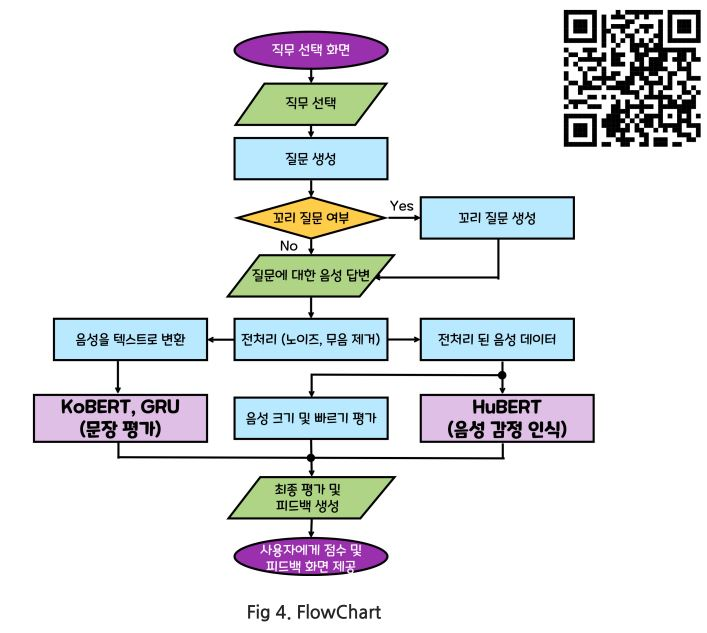
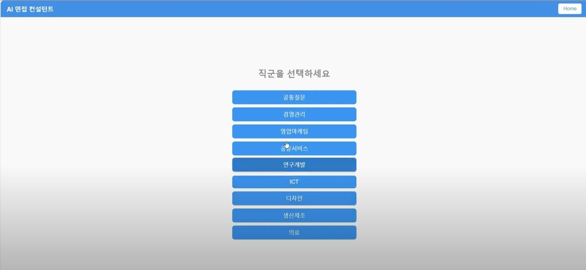

# AI-Interview | 면접 컨설턴트 AI

## 🌟 **Project Overview | 프로젝트 개요**
AI-Interview는 구직자의 면접 역량 강화를 목표로 설계된 AI 기반 면접 컨설턴트입니다. 음성 데이터와 텍스트 데이터를 활용해 구직자의 발화와 내용을 분석하여 피드백을 제공합니다. 주요 기능으로는 감정 분석, 빠르기 및 크기 평가, 꼬리 질문 생성 등이 있으며, 개인 맞춤형 솔루션을 통해 면접 준비 과정에서의 어려움을 해결합니다.



---

## 🧑‍🤝‍🧑 **Team Members | 팀원**
- **13기**: 권민지, 김서윤, 이형석  
- **14기**: 김홍재, 배한준

---

## 📅 **Progress Period | 진행 기간**
- **2024.09.04 ~ 2024.12.04**

---

## 📊 **Data Collection | 데이터 수집**
- **음성 데이터**: 감정 분류를 위한 대화 음성 데이터 (AI Hub), 채용면접 데이터 (AI Hub)
- **텍스트 데이터**: 에세이 글 평가 데이터 (AI Hub)  
- **질문 데이터**: 직무별 면접 예상 질문 리스트  

---

## 🚀 **Features | 주요 기능**
### 음성 피드백
- **발음 분석**: 발음 오류와 정확도 평가
- **감정 분석**: 'fear'와 'not fear' 이진 분류 (HuBERT 기반)
- **빠르기 평가**: SPM(Syllables Per Minute) 계산을 통한 속도 분석
- **크기 평가**: RMS(Root Mean Square)를 통한 음성 크기 변화 탐지
- **휴지**: RMS(Root Mean Square)기반 에너지 계산을 통한 무음 비율 분석

### 텍스트 피드백
- **답변 구성 평가**: 내용, 표현, 구성 점수로 평가
- **꼬리 질문 생성**: GPT 기반의 LangChain을 이용한 추가 질문 생성
- **간투어 분석**: '음', '어', '그런데' 등 불필요한 말버릇의 빈도 분석 

### 종합 평가
- 문장별 및 음성 특성을 기반으로 최종 점수 및 피드백 제공

---

## 📁 **Key Directories and Files | 주요 디렉토리 및 파일**
- `presentation/`: 주제 선정 배경, 피드백 구체화 등을 포함한 발표 자료
- `notebooks/`: HuBERT 및 GRU 기반 모델 학습 Jupyter notebook  
- `scripts/`: 데이터 전처리 및 분석 스크립트  
- `images/`: 이미지 디렉토리  
- `Web/`: 백엔드(flask) 및 프론트엔드(react) 코드 


---

## 🛠️ **Installation and Execution | 설치 및 실행 방법**
1. **Clone the repository | 저장소 클론**:
    ```bash
    git clone https://github.com/your-repo/AI-Interview.git
    cd AI-Interview
    ```

2. **Install required packages | 필수 패키지 설치**:
    ```bash
    pip install -r requirements.txt
    ```

3. **Run the main script | 실행**:
    ```bash
    python ./Web/backend/main.py
    ```

---

## 📖 **Usage | 사용 방법**
- 피드백 페이지 실행은 `Web/Backend/main.py`에서 실행합니다.  
- 피드백 구현 코드는 `Web/Backend/feedback.py`에서 확인합니다.
- 문장 평가 모델은  `notebooks/Sentence_Evaluation.ipynb`에서 확인합니다.
- 음성 감정 분석은  `notebooks/Voice_emotion_analysis.ipynb`에서 확인합니다.
---

## 📽️ Demonstration | 데모 시연

### 1. 결과 페이지



### 2. Flowchart



### 3. 동영상 데모 (사진을 클릭해주세요)
[](https://www.youtube.com/watch?v=IgEfCTvjx6E)

---

## 🎯 **Project Impact | 프로젝트 효용**
- **저비용 면접 컨설팅**: 경제적 부담을 줄이고 실질적 지원 제공  
- **실시간 피드백**: 빠른 개선과 시간 효율성 제공  
- **개인화된 훈련 제공**: 구직자의 역량 강화에 기여  
- **접근성 향상**: 장소와 시간에 구애받지 않는 면접 준비 가능  

---

## 📜 **License | 라이선스**
This project is licensed under the MIT License. See the [LICENSE](./LICENSE) file for details.  
이 프로젝트는 MIT 라이선스 하에 배포됩니다. 자세한 내용은 [LICENSE](./LICENSE) 파일을 참고하세요.
